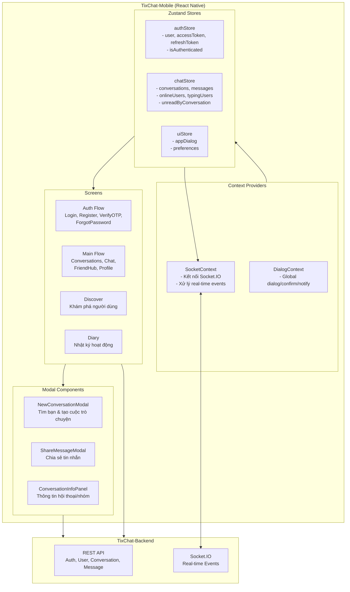

# TixChat-Mobile: Kế hoạch Triển khai Đầy đủ Chức năng

## 1. Tổng quan

Tài liệu này phân tích chi tiết các công việc cần thực hiện để hoàn thành **TixChat-Mobile** với feature parity đầy đủ so với **TixChat-Frontend** (web), sử dụng **Zustand** cho state management, và gọi API hoàn toàn qua **TixChat-Backend**.

---

## 2. Kiến trúc Mục tiêu



---

## 3. Cấu trúc State Management (Zustand)

### 3.1. authStore.js

```javascript
// src/stores/authStore.js
import { create } from 'zustand'
import { storage } from '../services/storage'

const useAuthStore = create((set, get) => ({
  user: null,
  accessToken: null,
  refreshToken: null,
  isAuthenticated: false,
  authLoading: false,
  authError: '',

  initialize: async () => {
    const cached = await storage.getAuth()
    if (cached?.accessToken && cached?.user) {
      set({
        user: cached.user,
        accessToken: cached.accessToken,
        refreshToken: cached.refreshToken || '',
        isAuthenticated: true,
      })
    }
  },

  setAuth: async (user, accessToken, refreshToken) => {
    await storage.setAuth({ user, accessToken, refreshToken })
    set({ user, accessToken, refreshToken, isAuthenticated: true, authError: '' })
  },

  updateUser: (user) => {
    const current = get()
    storage.setAuth({ user, accessToken: current.accessToken, refreshToken: current.refreshToken })
    set({ user })
  },

  setAuthLoading: (loading) => set({ authLoading: loading }),
  setAuthError: (error) => set({ authError: error }),

  logout: async () => {
    disconnectSocket()
    await storage.clearAuth()
    set({ user: null, accessToken: null, refreshToken: null, isAuthenticated: false, authError: '' })
  },
}))
```

### 3.2. chatStore.js

```javascript
// src/stores/chatStore.js
import { create } from 'zustand'
import { storage } from '../services/storage'

const normalizeId = (value) => {
  if (!value) return ''
  if (typeof value === 'object') {
    return String(value._id || value.userId || value.id || value.conversationId || value.messageId || '')
  }
  return String(value)
}

const useChatStore = create((set, get) => ({
  conversations: [],
  currentConversation: null,
  messages: [],
  onlineUsers: [],
  typingUsers: {},
  unreadByConversation: {},
  friendRequestCount: 0,
  preferences: {},

  // Conversations
  setConversations: (conversations) => set({ conversations }),
  upsertConversation: (conversationId, patch) => {
    set((state) => {
      const existing = state.conversations.find(
        (c) => normalizeId(c?._id || c?.conversationId) === conversationId
      )
      const merged = { ...(existing || { _id: conversationId }), ...patch }
      const next = state.conversations.filter(
        (c) => normalizeId(c?._id || c?.conversationId) !== conversationId
      )
      return { conversations: [...next, merged] }
    })
  },
  removeConversation: (conversationId) => {
    set((state) => ({
      conversations: state.conversations.filter(
        (c) => normalizeId(c?._id || c?.conversationId) !== conversationId
      ),
      currentConversation: normalizeId(state.currentConversation?._id) === conversationId
        ? null
        : state.currentConversation,
    }))
  },

  // Current Conversation
  setCurrentConversation: (conversation) => set({ currentConversation: conversation }),
  clearCurrentConversation: () => set({ currentConversation: null, messages: [] }),

  // Messages
  setMessages: (messages) => set({ messages }),
  addMessage: (message) => {
    set((state) => {
      const exists = state.messages.some(
        (m) => normalizeId(m?._id || m?.messageId) === normalizeId(message?._id || message?.messageId)
      )
      if (exists) return { messages: state.messages }
      return { messages: [...state.messages, message] }
    })
  },
  updateMessage: (messageId, updatedMessage) => {
    set((state) => ({
      messages: state.messages.map((msg) =>
        normalizeId(msg?._id || msg?.messageId) === normalizeId(messageId)
          ? { ...msg, ...updatedMessage }
          : msg
      ),
    }))
  },
  deleteMessage: (messageId) => {
    set((state) => ({
      messages: state.messages.map((msg) =>
        normalizeId(msg?._id || msg?.messageId) === normalizeId(messageId)
          ? { ...msg, isDeleted: true }
          : msg
      ),
    }))
  },

  // Online Users
  setOnlineUsers: (users) => set({ onlineUsers: users }),
  addOnlineUser: (userId) => {
    set((state) => ({
      onlineUsers: state.onlineUsers.some((u) => normalizeId(u?._id) === normalizeId(userId))
        ? state.onlineUsers
        : [...state.onlineUsers, { _id: userId }],
    }))
  },
  removeOnlineUser: (userId) => {
    set((state) => ({
      onlineUsers: state.onlineUsers.filter((u) => normalizeId(u?._id) !== normalizeId(userId)),
    }))
  },

  // Typing Users
  setTypingUser: (conversationId, userId, isTyping) => {
    set((state) => ({
      typingUsers: {
        ...state.typingUsers,
        [conversationId]: {
          ...(state.typingUsers[conversationId] || {}),
          [userId]: isTyping,
        },
      },
    }))
  },

  // Unread Counts
  setUnreadCounts: (counts) => set({ unreadByConversation: counts || {} }),
  incrementUnread: (conversationId) => {
    set((state) => ({
      unreadByConversation: {
        ...state.unreadByConversation,
        [conversationId]: (Number(state.unreadByConversation?.[conversationId]) || 0) + 1,
      },
    }))
  },
  clearUnread: (conversationId) => {
    set((state) => ({
      unreadByConversation: { ...state.unreadByConversation, [conversationId]: 0 },
    }))
  },

  // Friend Requests
  setFriendRequestCount: (count) => set({ friendRequestCount: Math.max(0, count || 0) }),
  incrementFriendRequestCount: () => {
    set((state) => ({ friendRequestCount: (state.friendRequestCount || 0) + 1 }))
  },
  decrementFriendRequestCount: () => {
    set((state) => ({ friendRequestCount: Math.max(0, (state.friendRequestCount || 0) - 1) }))
  },

  // Preferences
  setPreferences: (preferences) => set({ preferences }),
  updatePreference: (conversationId, patch) => {
    set((state) => ({
      preferences: {
        ...state.preferences,
        [conversationId]: { ...(state.preferences?.[conversationId] || {}), ...patch },
      },
    }))
  },
  savePreferences: async () => {
    await storage.setConversationPreferences(get().preferences)
  },
}))
```

### 3.3. uiStore.js (Dialog/Notification)

```javascript
// src/stores/uiStore.js
import { create } from 'zustand'

const useUiStore = create((set) => ({
  dialog: {
    visible: false,
    title: '',
    message: '',
    actions: [{ text: 'OK', style: 'default' }],
  },

  showDialog: ({ title, message, actions }) => {
    const safeActions = Array.isArray(actions) && actions.length > 0
      ? actions
      : [{ text: 'OK', style: 'default' }]
    set({ dialog: { visible: true, title: String(title || ''), message: String(message || ''), actions: safeActions } })
  },

  closeDialog: () => {
    set((state) => ({ dialog: { ...state.dialog, visible: false } }))
  },

  // Convenience methods
  showNotice: (title, message) => {
    set({ dialog: { visible: true, title, message, actions: [{ text: 'OK', style: 'default' }] } })
  },

  showConfirm: async ({ title, message, confirmText = 'Xác nhận', cancelText = 'Hủy', variant = 'warning' }) => {
    return new Promise((resolve) => {
      set({
        dialog: {
          visible: true,
          title,
          message,
          actions: [
            { text: cancelText, style: 'cancel', onPress: () => resolve(false) },
            { text: confirmText, style: variant, onPress: () => resolve(true) },
          ],
        },
      })
    })
  },
}))
```

---

## 4. Socket Events Cần Xử lý

### 4.1. Backend Socket Events (handlers.js)

| Event | Mô tả | Mobile Handler |
|-------|-------|----------------|
| `message:received` | Tin nhắn mới đến | Thêm vào messages, tăng unread |
| `message:delivered` | Tin nhắn đã được gửi đến người nhận | Cập nhật trạng thái message |
| `message:seen` | Tin nhắn đã được đọc | Cập nhật trạng thái message |
| `message:edited` | Tin nhắn đã được sửa | Cập nhật nội dung message |
| `message:deleted` | Tin nhắn đã được xóa (global) | Đánh dấu isDeleted |
| `message:hidden` | Tin nhắn bị ẩn với người dùng | Xóa khỏi danh sách |
| `message:emoji` | Reaction được thêm/sửa | Cập nhật reactions |
| `typing:start` | Người dùng bắt đầu nhập | Hiển thị "đang nhập..." |
| `typing:stop` | Người dùng dừng nhập | Ẩn "đang nhập..." |
| `user:online` | Người dùng online | Thêm vào danh sách online |
| `user:offline` | Người dùng offline | Xóa khỏi danh sách online |
| `user:presence` | Trạng thái presence | Cập nhật trạng thái |
| `participant:added` | Thành viên được thêm vào nhóm | Cập nhật danh sách participants |
| `participant:removed` | Thành viên bị xóa khỏi nhóm | Cập nhật danh sách participants |
| `participant:role_updated` | Vai trò thành viên thay đổi | Cập nhật role |
| `conversation:created` | Cuộc trò chuyện mới được tạo | Thêm vào danh sách |
| `conversation:dissolved` | Nhóm bị giải tán | Xóa khỏi danh sách |
| `friend_request:new` | Lời mời kết bạn mới | Tăng friendRequestCount |
| `friend_request:sent` | Đã gửi lời mời kết bạn | Cập nhật UI |
| `friend_request:accepted` | Lời mời kết bạn được chấp nhận | Cập nhật danh sách bạn bè |
| `friend_request:rejected` | Lời mời kết bạn bị từ chối | Cập nhật UI |

### 4.2. SocketContext Implementation

```javascript
// src/contexts/SocketContext.jsx
import React, { createContext, useContext, useEffect, useRef } from 'react'
import { io } from 'socket.io-client'
import { useAuthStore } from '../stores/authStore'
import { useChatStore } from '../stores/chatStore'
import { API_URL, SOCKET_URL } from '../config/env'

const SocketContext = createContext(null)

export const useSocket = () => {
  const context = useContext(SocketContext)
  if (!context) throw new Error('useSocket must be used within SocketProvider')
  return context
}

export const SocketProvider = ({ children }) => {
  const socketRef = useRef(null)
  const { accessToken, user } = useAuthStore()
  const {
    addMessage,
    updateMessage,
    deleteMessage,
    setTypingUser,
    addOnlineUser,
    removeOnlineUser,
    upsertConversation,
    removeConversation,
    incrementUnread,
    clearUnread,
    incrementFriendRequestCount,
    decrementFriendRequestCount,
    currentConversation,
  } = useChatStore()

  useEffect(() => {
    if (!accessToken) return

    const socket = io(SOCKET_URL, {
      auth: { token: accessToken },
      transports: ['websocket'],
    })

    socketRef.current = socket

    // Connection events
    socket.on('connect', () => console.log('Socket connected'))
    socket.on('disconnect', () => console.log('Socket disconnected'))
    socket.on('error', (err) => console.error('Socket error:', err))

    // Message events
    socket.on('message:received', ({ message }) => {
      const isCurrentConv = normalizeId(message?.conversationId) === normalizeId(currentConversation?._id)
      if (isCurrentConv) {
        addMessage(message)
        socket.emit('message:seen', { conversationId: message.conversationId })
        clearUnread(message.conversationId)
      } else {
        incrementUnread(message.conversationId)
      }
      upsertConversation(message.conversationId, { latestMessage: message })
    })

    socket.on('message:delivered', ({ messageId, userId }) => {
      updateMessage(messageId, { status: 'delivered', deliveredBy: userId })
    })

    socket.on('message:seen', ({ conversationId, userId }) => {
      updateMessage(conversationId, { seenBy: [...(prev.seenBy || []), userId] })
    })

    socket.on('message:edited', ({ message }) => {
      if (message) updateMessage(message._id || message.messageId, message)
    })

    socket.on('message:deleted', ({ messageId }) => {
      deleteMessage(messageId)
    })

    socket.on('message:hidden', ({ messageId, conversationId }) => {
      deleteMessage(messageId)
    })

    socket.on('message:emoji', ({ message }) => {
      if (message) updateMessage(message._id || message.messageId, { reactions: message.reactions })
    })

    // Typing events
    socket.on('typing:start', ({ conversationId, userId }) => {
      setTypingUser(conversationId, userId, true)
    })

    socket.on('typing:stop', ({ conversationId, userId }) => {
      setTypingUser(conversationId, userId, false)
    })

    // Presence events
    socket.on('user:online', ({ userId }) => addOnlineUser(userId))
    socket.on('user:offline', ({ userId }) => removeOnlineUser(userId))
    socket.on('user:presence', ({ userId, status }) => {
      if (status === 'offline') removeOnlineUser(userId)
      else addOnlineUser(userId)
    })

    // Conversation events
    socket.on('participant:added', ({ conversationId }) => {
      // Refresh conversation data
    })

    socket.on('participant:removed', ({ conversationId }) => {
      // Refresh conversation data
    })

    socket.on('participant:role_updated', ({ conversationId, targetUserId, newRole }) => {
      // Update participant role in conversation
    })

    socket.on('conversation:created', ({ conversationId }) => {
      // Fetch and add new conversation
    })

    socket.on('conversation:dissolved', ({ conversationId }) => {
      removeConversation(conversationId)
    })

    // Friend request events
    socket.on('friend_request:new', () => incrementFriendRequestCount())
    socket.on('friend_request:sent', () => {})
    socket.on('friend_request:accepted', () => decrementFriendRequestCount())
    socket.on('friend_request:rejected', () => {})

    return () => {
      socket.disconnect()
      socketRef.current = null
    }
  }, [accessToken, user?._id])

  const emitTypingStart = (conversationId) => {
    socketRef.current?.emit('typing:start', { conversationId })
  }

  const emitTypingStop = (conversationId) => {
    socketRef.current?.emit('typing:stop', { conversationId })
  }

  const joinConversation = (conversationId) => {
    socketRef.current?.emit('conversation:join', { conversationId })
  }

  const leaveConversation = (conversationId) => {
    socketRef.current?.emit('conversation:leave', { conversationId })
  }

  return (
    <SocketContext.Provider value={{ socket: socketRef.current, emitTypingStart, emitTypingStop, joinConversation, leaveConversation }}>
      {children}
    </SocketContext.Provider>
  )
}
```

---

## 5. Components Cần Tạo Mới

### 5.1. NewConversationModal.js

**Chức năng:** Tìm bạn, xem lời mời kết bạn, tạo cuộc trò chuyện 1-1

**Props:**
```javascript
{
  visible: boolean,
  onClose: () => void,
  onStartConversation: (userId: string) => void,
  onPendingRequestsChange: (count: number) => void,
}
```

**Tính năng:**
- Tìm kiếm người dùng theo username/tên
- Hiển thị lời mời kết bạn chờ xác nhận
- Hiển thị danh sách bạn bè
- Gửi/chấp nhận/từ chối lời mời kết bạn
- Bắt đầu cuộc trò chuyện với bạn bè
- Hủy kết bạn

**API sử dụng:**
- `userService.searchUsers(query)`
- `userService.getFriends()`
- `userService.getFriendRequests()`
- `userService.sendFriendRequest(friendId)`
- `userService.acceptFriendRequest(requesterId)`
- `userService.rejectFriendRequest(requesterId)`
- `userService.removeFriend(friendId)`
- `conversationService.createConversation('1-1', [userId])`

### 5.2. ShareMessageModal.js

**Chức năng:** Chia sẻ tin nhắn đến nhiều cuộc trò chuyện

**Props:**
```javascript
{
  visible: boolean,
  onClose: () => void,
  message: object, // Tin nhắn cần chia sẻ
  onShare: (targetConversationIds: string[]) => Promise<void>,
}
```

**Tính năng:**
- Hiển thị preview tin nhắn
- Tìm kiếm bạn bè
- Chọn nhiều cuộc trò chuyện để chia sẻ
- Gửi tin nhắn đến các cuộc trò chuyện đã chọn

**API sử dụng:**
- `userService.getFriends()`
- `messageService.forwardAttachmentByUrl()` cho attachments
- `messageService.sendMessage()` cho text

### 5.3. ConversationInfoPanel.js

**Chức năng:** Panel thông tin cuộc trò chuyện/hội thoại nhóm

**Props:**
```javascript
{
  visible: boolean,
  conversation: object,
  currentUserId: string,
  messages: array,
  onClose: () => void,
  onUpdatePreference: (patch: object) => void,
  onDeleteConversation: () => void,
  onRefreshData: () => void,
}
```

**Tính năng (1-1 chat):**
- Xem thông tin người dùng
- Đặt biệt danh
- Tắt thông báo (với thời gian)
- Tìm tin nhắn trong đoạn chat
- Ghim/Ẩn cuộc trò chuyện
- Tạo nhóm với người này
- Xóa lịch sử trò chuyện

**Tính năng (Group):**
- Tất cả tính năng 1-1
- Đổi tên nhóm
- Đổi avatar nhóm
- Thêm thành viên
- Xóa thành viên
- Cập nhật vai trò (admin/moderator/member)
- Cài đặt nhóm (allowMemberEditGroupInfo, adminOnlyMessaging, requiresAdminApproval, etc.)
- Rời nhóm / Giải tán nhóm (chỉ chủ nhóm)
- Xem lịch sử media/file/link

**API sử dụng:**
- `userService.getProfile(userId)`
- `userService.getFriends()`
- `conversationService.getParticipants(conversationId)`
- `conversationService.updateConversation(conversationId, data)`
- `conversationService.updateConversationAvatar(conversationId, formData)`
- `conversationService.addParticipant(conversationId, participantId)`
- `conversationService.removeParticipant(conversationId, participantId)`
- `conversationService.updateParticipantRole(conversationId, participantId, role)`
- `conversationService.updateGroupSettings(conversationId, data)`
- `conversationService.leaveConversation(conversationId)`
- `conversationService.dissolveConversation(conversationId)`
- `conversationService.deleteConversation(conversationId)`

### 5.4. ErrorBoundary.js

**Chức năng:** Bắt lỗi React, hiển thị UI fallback

```javascript
// src/components/ErrorBoundary.js
import React from 'react'

export class ErrorBoundary extends React.Component {
  state = { hasError: false, error: null }

  static getDerivedStateFromError(error) {
    return { hasError: true, error }
  }

  componentDidCatch(error, errorInfo) {
    console.error('ErrorBoundary caught:', error, errorInfo)
  }

  render() {
    if (this.state.hasError) {
      return (
        <View style={styles.container}>
          <Text style={styles.title}>Oops! Something went wrong</Text>
          <Text style={styles.message}>{this.state.error?.message}</Text>
          <Button title="Try Again" onPress={() => this.setState({ hasError: false })} />
        </View>
      )
    }
    return this.props.children
  }
}
```

### 5.5. DialogContext.js

**Chức năng:** Context provider cho global dialog/confirm/notify

```javascript
// src/contexts/DialogContext.jsx
import React, { createContext, useContext } from 'react'
import { useUiStore } from '../stores/uiStore'

const DialogContext = createContext(null)

export const useDialog = () => useContext(DialogContext)

export const DialogProvider = ({ children }) => {
  const { dialog, showDialog, closeDialog, showNotice, showConfirm } = useUiStore()

  const notify = async (options) => {
    showDialog(options)
  }

  const confirm = async (options) => {
    return showConfirm(options)
  }

  const prompt = async (options) => {
    // For mobile, we can use Alert.prompt or a custom modal
    return showConfirm(options)
  }

  return (
    <DialogContext.Provider value={{ dialog, notify, confirm, prompt, closeDialog }}>
      {children}
    </DialogContext.Provider>
  )
}
```

---

## 6. Screens Cần Hoàn thiện

### 6.1. Discover Screen

**Route:** `/discover` hoặc tab trong navigation

**Chức năng:**
- Khám phá người dùng mới
- Tìm kiếm người dùng theo username/tên
- Gửi lời mời kết bạn
- Xem người dùng đang online

**API:**
- `userService.searchUsers(query)`
- `userService.getOnlineUsers()`
- `userService.sendFriendRequest(friendId)`

### 6.2. Diary Screen

**Route:** `/diary` hoặc tab trong navigation

**Chức năng:**
- Nhật ký hoạt động của người dùng
- Xem các cuộc trò chuyện gần đây
- Xem tin nhắn đã gửi/nhận
- Thống kê (số tin nhắn, số cuộc trò chuyện)

**Lưu ý:** Đây có thể là placeholder ban đầu, sau đó mở rộng thêm tính năng.

---

## 7. Cấu trúc File Mục tiêu

```
TixChat-Mobile/
├── src/
│   ├── App.js                    # Root component với ErrorBoundary
│   ├── AppRoot.js                # Main app với navigation (refactor sau)
│   │
│   ├── stores/                   # Zustand stores
│   │   ├── authStore.js
│   │   ├── chatStore.js
│   │   └── uiStore.js
│   │
│   ├── contexts/                 # Context providers
│   │   ├── SocketContext.jsx
│   │   └── DialogContext.jsx
│   │
│   ├── services/                 # API services (giữ nguyên)
│   │   ├── api.js
│   │   ├── apiContracts.js
│   │   ├── socket.js
│   │   ├── socketCore.js
│   │   └── storage.js
│   │
│   ├── components/               # UI Components
│   │   ├── AuthScreen.js
│   │   ├── RegisterScreen.js
│   │   ├── VerifyOtpScreen.js
│   │   ├── ForgotPasswordScreen.js
│   │   ├── ConversationListScreen.js
│   │   ├── ChatScreen.js
│   │   ├── ProfileScreen.js
│   │   ├── FriendHubScreen.js
│   │   ├── CreateGroupScreen.js
│   │   ├── DiscoverScreen.js       # MỚI
│   │   ├── DiaryScreen.js          # MỚI
│   │   ├── AppDialogModal.js
│   │   ├── NewConversationModal.js  # MỚI
│   │   ├── ShareMessageModal.js     # MỚI
│   │   └── ConversationInfoPanel.js # MỚI
│   │
│   ├── hooks/                    # Custom hooks
│   │   ├── useAuth.js
│   │   ├── useChat.js
│   │   └── useSocket.js
│   │
│   ├── utils/
│   │   └── normalize.js
│   │
│   └── config/
│       └── env.js
│
├── package.json
└── app.json
```

---

## 8. Chi tiết Công việc

### Phase 1: Cơ sở hạ tầng (Infrastructure)

| # | Task | Mô tả | File |
|---|------|-------|------|
| 1.1 | Cài đặt Zustand | Thêm zustand vào dependencies | `package.json` |
| 1.2 | Tạo authStore | State cho authentication | `src/stores/authStore.js` |
| 1.3 | Tạo chatStore | State cho chat (conversations, messages, etc.) | `src/stores/chatStore.js` |
| 1.4 | Tạo uiStore | State cho UI (dialog, preferences) | `src/stores/uiStore.js` |
| 1.5 | Tạo SocketContext | Context cho Socket.IO connection | `src/contexts/SocketContext.jsx` |
| 1.6 | Tạo DialogContext | Context cho dialog/notify/confirm | `src/contexts/DialogContext.jsx` |
| 1.7 | Tạo ErrorBoundary | Component bắt lỗi | `src/components/ErrorBoundary.js` |

### Phase 2: Components UI

| # | Task | Mô tả | File |
|---|------|-------|------|
| 2.1 | NewConversationModal | Tìm bạn & tạo cuộc trò chuyện | `src/components/NewConversationModal.js` |
| 2.2 | ShareMessageModal | Chia sẻ tin nhắn | `src/components/ShareMessageModal.js` |
| 2.3 | ConversationInfoPanel | Panel thông tin hội thoại/nhóm | `src/components/ConversationInfoPanel.js` |
| 2.4 | Cập nhật ConversationListScreen | Thêm nút NewConversationModal | `src/components/ConversationListScreen.js` |
| 2.5 | Cập nhật ChatScreen | Tích hợp ShareMessageModal, ConversationInfoPanel | `src/components/ChatScreen.js` |

### Phase 3: Socket Events

| # | Task | Mô tả | Event |
|---|------|-------|-------|
| 3.1 | message:delivered | Xử lý khi tin nhắn được gửi đến người nhận | `message:delivered` |
| 3.2 | message:seen | Xử lý khi tin nhắn được đọc | `message:seen` |
| 3.3 | user:online/offline | Cập nhật danh sách online users | `user:online`, `user:offline` |
| 3.4 | user:presence | Cập nhật trạng thái presence | `user:presence` |
| 3.5 | participant:added | Xử lý thành viên được thêm | `participant:added` |
| 3.6 | participant:removed | Xử lý thành viên bị xóa | `participant:removed` |
| 3.7 | conversation:created | Xử lý cuộc trò chuyện mới | `conversation:created` |
| 3.8 | conversation:dissolved | Xử lý nhóm bị giải tán | `conversation:dissolved` |
| 3.9 | friend_request:new | Xử lý lời mời kết bạn mới | `friend_request:new` |
| 3.10 | friend_request:accepted | Xử lý chấp nhận kết bạn | `friend_request:accepted` |
| 3.11 | friend_request:rejected | Xử lý từ chối kết bạn | `friend_request:rejected` |
| 3.12 | message:hidden | Xử lý tin nhắn bị ẩn | `message:hidden` |

### Phase 4: Screens

| # | Task | Mô tả | File |
|---|------|-------|------|
| 4.1 | DiscoverScreen | Khám phá người dùng | `src/components/DiscoverScreen.js` |
| 4.2 | DiaryScreen | Nhật ký hoạt động | `src/components/DiaryScreen.js` |
| 4.3 | Cập nhật Navigation | Thêm routes cho Discover/Diary | `src/AppRoot.js` |

### Phase 5: Refactoring (Tùy chọn)

| # | Task | Mô tả | File |
|---|------|-------|------|
| 5.1 | Tái cấu trúc AppRoot.js | Chia nhỏ thành hooks/contexts | `src/AppRoot.js` |
| 5.2 | Tái cấu trúc ChatScreen.js | Chia nhỏ thành components nhỏ hơn | `src/components/ChatScreen.js` |

---

## 9. API Endpoints Sử dụng

### 9.1. Auth APIs
```javascript
authApi.register(payload)           // Đăng ký
authApi.login(email, password)       // Đăng nhập
authApi.logout()                      // Đăng xuất
authApi.forgotPassword(email)         // Quên mật khẩu
authApi.verifyResetToken(email, token) // Xác minh token reset
authApi.resetPassword(...)            // Reset mật khẩu
authApi.sendEmailVerificationOtp(email) // Gửi OTP
authApi.verifyEmailOtp(email, otp)    // Xác minh OTP
authApi.refreshToken(refreshToken)    // Refresh token
authApi.getMe()                       // Lấy thông tin user hiện tại
```

### 9.2. User APIs
```javascript
userApi.getProfile(userId)           // Lấy profile user
userApi.getCurrentProfile()          // Lấy profile của mình
userApi.updateProfile(data)          // Cập nhật profile
userApi.updateAvatar(formData)       // Cập nhật avatar
userApi.changePassword(data)         // Đổi mật khẩu
userApi.searchUsers(query)           // Tìm kiếm user
userApi.getFriends()                 // Lấy danh sách bạn bè
userApi.getFriendRequests()          // Lấy lời mời kết bạn
userApi.sendFriendRequest(friendId)  // Gửi lời mời kết bạn
userApi.acceptFriendRequest(requesterId) // Chấp nhận
userApi.rejectFriendRequest(requesterId)  // Từ chối
userApi.removeFriend(friendId)       // Xóa bạn bè
userApi.getOnlineUsers()             // Lấy users online
userApi.blockUser(userId)           // Block user
userApi.unblockUser(userId)          // Unblock user
```

### 9.3. Conversation APIs
```javascript
conversationApi.createConversation(type, participantIds, name) // Tạo conversation
conversationApi.getConversations(limit, skip)                  // Lấy danh sách
conversationApi.getConversation(conversationId)                 // Lấy chi tiết
conversationApi.updateConversation(conversationId, data)       // Cập nhật
conversationApi.updateConversationAvatar(conversationId, formData) // Đổi avatar
conversationApi.addParticipant(conversationId, participantId) // Thêm thành viên
conversationApi.removeParticipant(conversationId, participantId) // Xóa thành viên
conversationApi.getParticipants(conversationId)                // Lấy danh sách thành viên
conversationApi.updateParticipantRole(conversationId, participantId, role) // Cập nhật role
conversationApi.updateGroupSettings(conversationId, data)       // Cập nhật settings nhóm
conversationApi.getBlockedUsers(conversationId)                // Lấy users bị block
conversationApi.blockUserInConversation(conversationId, userId) // Block trong nhóm
conversationApi.unblockUserInConversation(conversationId, userId) // Unblock trong nhóm
conversationApi.leaveConversation(conversationId, leaveSilently) // Rời nhóm
conversationApi.dissolveConversation(conversationId)            // Giải tán nhóm
conversationApi.archiveConversation(conversationId)             // Lưu trữ
conversationApi.deleteConversation(conversationId)              // Xóa conversation
conversationApi.searchConversations(query)                     // Tìm kiếm
```

### 9.4. Message APIs
```javascript
messageApi.sendMessage(conversationId, content, replyTo, options)       // Gửi text
messageApi.sendAttachment(conversationId, file, content, replyTo, options) // Gửi file
messageApi.forwardAttachmentByUrl(...)                                  // Forward file
messageApi.getMessages(conversationId, limit, lastEvaluatedKey)         // Lấy messages
messageApi.editMessage(conversationId, messageId, content)              // Sửa message
messageApi.deleteMessage(conversationId, messageId)                     // Xóa (của mình)
messageApi.deleteMessageForAll(conversationId, messageId)               // Xóa (của tất cả)
messageApi.markAsDelivered(conversationId, messageId)                   // Đánh dấu đã gửi
messageApi.markAsSeen(conversationId)                                    // Đánh dấu đã đọc
messageApi.getUnreadCounts()                                            // Lấy số chưa đọc
messageApi.addEmoji(conversationId, messageId, emoji)                   // Thêm reaction
messageApi.removeEmoji(conversationId, messageId, emoji)                // Xóa reaction
```

---

## 10. Socket Events (Socket.IO)

### 10.1. Emit Events (Client → Server)
```javascript
socket.emit('send_message', { conversationId, content, replyTo })
socket.emit('message:delivered', { messageId })
socket.emit('message:seen', { conversationId })
socket.emit('message:edit', { conversationId, messageId, content })
socket.emit('message:delete', { conversationId, messageId })
socket.emit('message:emoji', { messageId, emoji })
socket.emit('typing:start', { conversationId })
socket.emit('typing:stop', { conversationId })
socket.emit('conversation:join', { conversationId })
socket.emit('conversation:leave', { conversationId })
socket.emit('set_presence', { status: 'online' | 'away' | 'offline' })
```

### 10.2. Listen Events (Server → Client)
```javascript
socket.on('message:sent', ({ message }) {})
socket.on('message:received', ({ message }) {})
socket.on('message:delivered', ({ messageId, userId }) {})
socket.on('message:seen', ({ conversationId, userId }) {})
socket.on('message:edited', ({ message }) {})
socket.on('message:deleted', ({ messageId, isDeleted }) {})
socket.on('message:hidden', ({ messageId, conversationId, hiddenBy }) {})
socket.on('message:emoji', ({ message }) {})
socket.on('typing:start', ({ conversationId, userId }) {})
socket.on('typing:stop', ({ conversationId, userId }) {})
socket.on('user:online', ({ userId }) {})
socket.on('user:offline', ({ userId }) {})
socket.on('user:presence', ({ userId, status }) {})
socket.on('participant:added', ({ conversationId, participantId, addedBy }) {})
socket.on('participant:removed', ({ conversationId, participantId }) {})
socket.on('participant:role_updated', ({ conversationId, targetUserId, oldRole, newRole }) {})
socket.on('conversation:created', ({ conversationId, type, participants }) {})
socket.on('conversation:dissolved', ({ conversationId, dissolvedByUserId }) {})
socket.on('friend_request:new', ({ fromUserId }) {})
socket.on('friend_request:sent', ({ toUserId }) {})
socket.on('friend_request:accepted', ({ byUserId }) {})
socket.on('friend_request:rejected', ({ byUserId }) {})
```

---

## 11. Questions / Clarifications

Trước khi bắt đầu implementation, xin hỏi:

### Q1: Discover Screen
**ĐÃ XÁC NHẬN:**
- [x] Tìm kiếm người dùng theo username/tên
- [x] Hiển thị người dùng đang online
- [x] Gợi ý người dùng phổ biến
- [x] Xem profile người dùng khác

### Q2: Diary Screen
**ĐÃ XÁC NHẬN:**
- [x] Placeholder đơn giản trước, mở rộng sau

### Q3: Navigation Structure
**ĐÃ XÁC NHẬN:**
- [x] Giữ nguyên cấu trúc hiện tại, chỉ thêm Discover/Diary tabs

### Q4: Priority
**ĐÃ XÁC NHẬN:**
- [x] Stores trước - xây dựng cơ sở hạ tầng state management

---

## 12. Dependencies Cần Thêm

```json
{
  "dependencies": {
    "zustand": "^4.5.0",
    "@react-navigation/bottom-tabs": "^6.5.0",
    "socket.io-client": "^4.7.0"
  }
}
```

---

## 13. Checklist Trước Khi Bắt đầu

- [ ] Xác nhận các questions ở trên
- [ ] Backup code hiện tại
- [ ] Cài đặt dependencies mới
- [ ] Tạo branch mới cho implementation
- [ ] Bắt đầu Phase 1: Infrastructure
